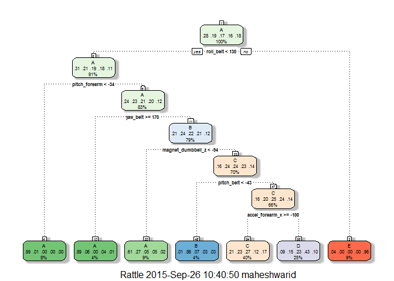
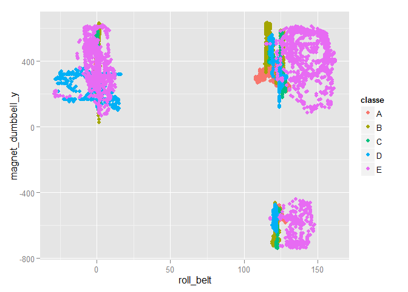

# Coursera Practical Machine Learning - Prediction Assignment Writeup
Maheshwari  
Friday, September 25, 2015  

#Summary
Using devices such as Jawbone Up, Nike FuelBand, and Fitbit it is now possible to collect a large amount of data about personal activity relatively inexpensively. These type of devices are part of the quantified self movement - a group of enthusiasts who take measurements about themselves regularly to improve their health, to find patterns in their behavior, or because they are tech geeks.

One thing that people regularly do is quantify how much of a particular activity they do, but they rarely quantify how well they do it. In this project, we will use data recorded from accelerometers on the belt, forearm, arm, and dumbbell of 6 participants. They were asked to perform barbell lifts correctly and incorrectly in 5 different ways.

More information is available from the website http://groupware.les.inf.puc-rio.br/har (see the section on the Weight Lifting Exercise Dataset).

The goal of this project is to predict the manner in which the volunteers did the exercise. The outcome is measured against 60 observations and classifed as "A,B,C,D,E" catogerise and it is stored in the classe variable in the data set.

#Preparing the data
Loading all the required packages

```
## Warning: package 'caret' was built under R version 3.1.3
```

```
## Loading required package: lattice
## Loading required package: ggplot2
```

```
## Warning: package 'rattle' was built under R version 3.1.3
```

```
## Loading required package: RGtk2
```

```
## Warning: package 'RGtk2' was built under R version 3.1.3
```

```
## Rattle: A free graphical interface for data mining with R.
## Version 3.5.0 Copyright (c) 2006-2015 Togaware Pty Ltd.
## Type 'rattle()' to shake, rattle, and roll your data.
```

```
## Warning: package 'rpart.plot' was built under R version 3.1.3
```

```
## Warning: package 'randomForest' was built under R version 3.1.3
```

```
## randomForest 4.6-10
## Type rfNews() to see new features/changes/bug fixes.
```

##Loading the data

```r
    wholedata <- read.csv("pml-training.csv", na.strings = c("NA", "#DIV/0!", ""))
    testingSet<-read.csv("pml-testing.csv",na.strings=c("NA","#DIV/0!"))
```

##Cleaning the data 
Removed the rows of data which has "NA" and also the variables which are not required
or useful for the predictions from both the training set and the testing set.

```r
    NA_Count = sapply(1:dim(wholedata)[2],function(x)sum(is.na(wholedata[,x])))
    NA_list = which(NA_Count>0)
    
    wholedata = wholedata[,-NA_list]
    wholedata = wholedata[,-c(1:7)]
    wholedata$classe = factor(wholedata$classe)

    NA_Count1 = sapply(1:dim(testingSet)[2],function(x)sum(is.na(testingSet[,x])))
    NA_list1 = which(NA_Count1>0)
    testingSet = testingSet[,-NA_list]
    testingSet = testingSet[,-c(1:7)]
    dim(wholedata)
```

```
## [1] 19622    53
```

```r
    dim(testingSet)
```

```
## [1] 20 53
```

From the data set creating the traning and testing data partitions. The test set of 20 observations provided will be used to validate the model at the end.


```r
    inTrain=createDataPartition(y=wholedata$classe, p=0.6, list=FALSE)
    training <-wholedata[inTrain,]
    testing <- wholedata[-inTrain,]
```
#Modelling
We now create our model using the functions provided in caret package in R.
## Tree Method
Using the Tree method to do the prediction of 'classe'.


```r
    modfit1 <- train(classe ~ .,method='rpart',data=training)
    fancyRpartPlot(modfit1$finalModel) 
```

 

```r
    pred=predict(modfit1,newdata=testing)
    z=confusionMatrix(pred,testing$classe)
    z$table
```

```
##           Reference
## Prediction    A    B    C    D    E
##          A 1361  252   32   73   19
##          B    6  273   41    9    7
##          C  645  673  809  385  552
##          D  191  320  486  819  176
##          E   29    0    0    0  688
```

```r
    z$overall[1]
```

```
##  Accuracy 
## 0.5034412
```
From the confusion matrix it is clear the accuracy of "0.49" for this model fit clearly shows "no purity" hence this model fit is rejected.

## Random Forest Method
Using Random forest method to do the prediction.

```r
    modfit2=randomForest(classe~., data=training, method='class')
    pred2 = predict(modfit2,testing,type='class') 
    qplot(roll_belt, magnet_dumbbell_y, colour=classe, data=training)  
```

 
Random forest prediction model provides 99% accurancy hence this model has been choosen to do predict the testing data set.

```r
    z2=confusionMatrix(pred2,testing$classe)
    z2$table
```

```
##           Reference
## Prediction    A    B    C    D    E
##          A 2224    7    0    0    0
##          B    6 1509    5    0    0
##          C    0    2 1360    9    3
##          D    0    0    3 1276    4
##          E    2    0    0    1 1435
```

```r
    z2$overall[1]
```

```
## Accuracy 
## 0.994647
```

#Conclusion
From the above results the random forest method provides the best fit model and it is been considered for testing the test data set to submit results.


```r
    pred3 =  predict(modfit2,testingSet,type='class')
    nofiles = length(pred3)
    for (i in 1:nofiles){
        filename =  paste0("problem_id",i,".txt")
        write.table(pred3[i],file=filename,quote=FALSE,row.names=FALSE,col.names=FALSE)
    }
    pred3
```

```
##  1  2  3  4  5  6  7  8  9 10 11 12 13 14 15 16 17 18 19 20 
##  B  A  B  A  A  E  D  B  A  A  B  C  B  A  E  E  A  B  B  B 
## Levels: A B C D E
```
